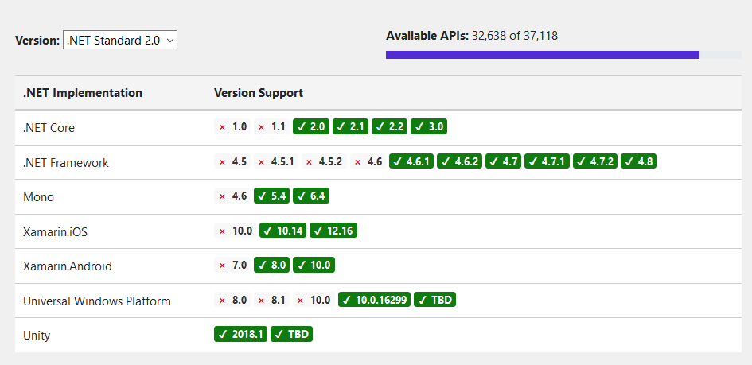

<div align="center">


# Librería en .Net para Timbrar y Cancelar Facturas Electrónicas de cualquier tipo


</div>

Librería en **.Net Standard** que permite generar cualquier tipo de comprobante digital **Ingreso, Egreso, Traslado, Nomina, Pago, etc.(Xml y PDF)** llenando los datos correspondientes fácilmente podrás generar las facturas digitales en cuestión de minutos. 

**Es ideal y compatible para integrarla en cualquier tipo de proyecto ya sean aplicaciones web, escritorio, moviles (Mono, Xamarin), silverligth, WPF, .Net Core, Universal Windows Platform, Unity, etc.** usa la librería directamente en el proyecto o agrega la referencia usando - [NuGet Package](https://www.nuget.org/packages/FacturoPorTi.Api.Cfdi)

Con esta libería además podrás timbrar, cancelar, obtener estatus del CFDI ante el SAT, consultar los timbres restantes entre otras cosas. 

No necesitas saber ninguna regla del SAT la librería generará el XML de acuerdo al anexo 20, la librería se encarga de todo  facilitando el proceso de integración de tu sistema y/o aplicación, servicio, para cumplir con lo que solicita el SAT.

La librería es muy liviana y rápida, utiliza llamadas Rest Api que permitirá generar tus CFDIs y enviar los por correo todo al mismo tiempo. 

## Requerimientos

Se recomienda usar el IDE de desarrollo Visual Studio 2015 o 2017 community o superior. Todas las versiones community son gratuitas y se pueden descargar desde https://visualstudio.microsoft.com/es/vs/community/ 

La librería tiene como requerimientos: 

- **Newtonsoft.Json 12.0.3**
- **Portable.BouncyCastle 1.8.5.2**

Además revisa la versión de framework que necesitas de acuerdo a tu proyecto:



## Instalación

Obten la última versión de la librería de  timbrado de FacturoPorTi  en **NuGet**:
**[FacturoPorTi.CFDI](https://www.nuget.org/packages/FacturoPorTi.Api.Cfdi "FacturoPorTi.Api.Cfdi")**

En [GitHub - FacturoPorTi-Factura-Electronica-dll](https://github.com/facturoporti/factura-electronica-Dll-Api-Rest "GitHub - FacturoPorTi-Factura-Electronica-dll") esta un proyecto de ejemplo completo del uso de todos los métodos de la librería; te recomendamos ampliamente que lo descargues y hagas pruebas con el.  

## Timbrar

Para mandar una peticion para timbrar se debe de generar un objeto de tipo **CFDIPeticion**, este a su vez tiene otros objetos que deben de llenarse: 

- DatosGeneralesCFDI
- EncabezadoCFDI
- ConceptoCFDI

```csharp

using System;
using System.Collections.Generic;
using System.IO;
using System.Linq;
using System.Text;
using System.Threading.Tasks;

using FacturoPorTi.Api.Cfdi;
using FacturoPorTi.Api.Cfdi.Entidades;
using FacturoPorTi.Api.Cfdi.Genericos;

  private static void TimbrarDocumento()
        {
            Archivos manager = new Archivos();

            TimbreFiscalDigital Timbre = new TimbreFiscalDigital();
            CFDIPeticion Peticion = new CFDIPeticion();
            Utilerias utilerias = new Utilerias();
            string NombreArchivo = string.Empty;

            #region "Datos Generales"

            Peticion.DatosGenerales = new DatosGeneralesCFDI();
            Peticion.DatosGenerales.Usuario = "PruebasTimbrado"; // Este usuario se genera desde la pagina de https://cfdi.facturoporti.com.mx/ se debe de registrar para usar el productivo
            Peticion.DatosGenerales.Password = "@Notiene1"; // Es la contraseña del usuario cuando se registró
            Peticion.DatosGenerales.GeneraPDF = "true";
            Peticion.DatosGenerales.EnviaEmail = "false"; // Valores permitidos "true" : "false";
            Peticion.DatosGenerales.ReceptorEmail = "correodestino@midominio.com";

            //Logotipo (opcional) acepta una imagen jpeg o png en base 64 menor a 100 KB
            //Peticion.DatosGenerales.Logotipo = manager.ConvertirByteToBase64(manager.ConvertirStreamToByte(manager.Abrir("Cambiar la ruta de lectura o enviar la imagen en base 64")));

            enumTipoDocumento TipoDocumentoActual = enumTipoDocumento.Factura;

            switch (TipoDocumentoActual)
            {
                case enumTipoDocumento.Factura:
                    Peticion.DatosGenerales.CFDI = "Factura";
                    Peticion.DatosGenerales.TipoCFDI = "Ingreso";
                    break;
                case enumTipoDocumento.NotaCargo:
                    Peticion.DatosGenerales.CFDI = "NotaCargo";
                    Peticion.DatosGenerales.TipoCFDI = "Ingreso";
                    break;
                case enumTipoDocumento.NotaCredito:
                    Peticion.DatosGenerales.CFDI = "NotaCredito";
                    Peticion.DatosGenerales.TipoCFDI = "Egreso";
                    break;
                case enumTipoDocumento.CartaPorte:
                    Peticion.DatosGenerales.CFDI = "CartaPorte";
                    Peticion.DatosGenerales.TipoCFDI = "Traslado";
                    break;
                case enumTipoDocumento.Pago:
                    Peticion.DatosGenerales.CFDI = "Pago";
                    Peticion.DatosGenerales.TipoCFDI = "Pago";
                    break;
                case enumTipoDocumento.ReciboNominaCFDI:
                    Peticion.DatosGenerales.CFDI = "ReciboNomina";
                    Peticion.DatosGenerales.TipoCFDI = "ReciboNomina";
                    break;
            }

            Peticion.DatosGenerales.OpcionDecimales = ((int)enumOpcionDecimales.Redondear).ToString(); // Valores permitidos 1: Truncar (Operaciones exactas) 2: Redondear hacia arriba o hacia abajo las cantidades 
            Peticion.DatosGenerales.NumeroDecimales = "2"; // El valor predeterminado es 2 hasta un máximo de 6 decimales

            #endregion "Datos Generales"

            #region "Encabezado"

            #region "Emisor"

            Peticion.Encabezado = new EncabezadoCFDI();
            Peticion.Encabezado.Emisor = new EmisorCFDI();
            Peticion.Encabezado.Emisor.RFC = "AAA010101AAA"; // Para realizar pruebas solamente se puede usar este RFC AAA010101AAA
            Peticion.Encabezado.Emisor.NombreRazonSocial = "Mi nombre o el nombre de mi empresa";
            Peticion.Encabezado.Emisor.RegimenFiscal = "601"; // Se agrega la clave de acuerdo al catálogo del SAT http://omawww.sat.gob.mx/tramitesyservicios/Paginas/documentos/catCFDI.xls

            // El domicilio de emision es opcional pero se agrega por peticion del usuario
            DireccionCFDI direccion = new DireccionCFDI();

            direccion.Calle = "Avenida Reforma";
            direccion.NumeroExterior = "1234";
            direccion.NumeroInterior = "XA";
            direccion.Colonia = "Roma Norte";
            direccion.Estado = "Ciudad de México";
            direccion.Municipio = "Benito Juarez";
            direccion.Pais = "México";
            direccion.CodigoPostal = "06470";

            Peticion.Encabezado.Emisor.Direccion = new List<DireccionCFDI>();
            Peticion.Encabezado.Emisor.Direccion.Add(direccion);

            #endregion "Emisor"

            #region "Receptor"

            Peticion.Encabezado.Receptor = new ReceptorCFDI();
            Peticion.Encabezado.Receptor.RFC = "XEXX010101000";
            Peticion.Encabezado.Receptor.NombreRazonSocial = "Nombre del cliente";
            Peticion.Encabezado.Receptor.UsoCFDI = "G03"; // Se agrega la clave de acuerdo al catálogo del SAT http://omawww.sat.gob.mx/tramitesyservicios/Paginas/documentos/catCFDI.xls

            // El domicilio del receptor es opcional pero se agrega por peticion del usuario
            direccion = new DireccionCFDI();

            direccion.Calle = "Leo";
            direccion.NumeroExterior = "9876";
            direccion.NumeroInterior = "A-34";
            direccion.Colonia = "San Rafael";
            direccion.Estado = "Morelos";
            direccion.Municipio = "Cuernavaca";
            direccion.Pais = "México";
            direccion.CodigoPostal = "62775";

            Peticion.Encabezado.Receptor.Direccion = direccion;

            #endregion "Receptor"

            Peticion.Encabezado.Fecha = DateTime.Now.ToString("yyyy-MM-ddTHH:mm:ss"); // Se debe de enviar con el formato indicado yyyy-MM-ddTHH:mm:ss
            Peticion.Encabezado.Serie = "A"; // Es el numero de serie es un valor opcional
            Peticion.Encabezado.Folio = "12"; // Es el numero de folio es un valor opcional
            Peticion.Encabezado.MetodoPago = "PUE";// Se agrega la clave de acuerdo al catálogo del SAT http://omawww.sat.gob.mx/tramitesyservicios/Paginas/documentos/catCFDI.xls
            Peticion.Encabezado.FormaPago = "99";// Se agrega la clave de acuerdo al catálogo del SAT http://omawww.sat.gob.mx/tramitesyservicios/Paginas/documentos/catCFDI.xls
            Peticion.Encabezado.Moneda = "MXN"; // Se agrega la clave de acuerdo al catálogo del SAT http://omawww.sat.gob.mx/tramitesyservicios/Paginas/documentos/catCFDI.xls
            Peticion.Encabezado.LugarExpedicion = "06470";
            Peticion.Encabezado.SubTotal = "1500"; // Es la suma de los importes en bruto
            Peticion.Encabezado.Total = "1740"; // Es la suma de los importes + los impuestos trasladados - los impuestos retenidos

            #endregion "Encabezado"

            #region "Conceptos"

            Peticion.Conceptos = new List<ConceptoCFDI>();

            ConceptoCFDI concepto = new ConceptoCFDI();

            concepto.Cantidad = "1";
            concepto.CodigoUnidad = "E48"; // Se agrega la clave de acuerdo al catálogo del SAT http://omawww.sat.gob.mx/tramitesyservicios/Paginas/documentos/catCFDI.xls
            //concepto.Unidad = "Pieza"; // Este es un valor opcional 
            //concepto.Serie = ""; // Este es un valor opcional se agregan numero de series, partes, etc.
            concepto.CodigoProducto = "53112101";// Se agrega la clave de acuerdo al catálogo del SAT http://omawww.sat.gob.mx/tramitesyservicios/Paginas/documentos/catCFDI.xls
            concepto.Producto = "Zapatos de caballero marca patito";
            concepto.PrecioUnitario = "1000";
            concepto.Importe = "1000";

            concepto.Impuestos = new List<ImpuestosCFDI>();
            ImpuestosCFDI impuesto = new ImpuestosCFDI();

            impuesto.TipoImpuesto = ((int)enumTipoImpuesto.Trasladado).ToString(); // Tipo de impuesto se envía la clave 1 traslado 2 retenido
            impuesto.Impuesto = ((int)enumImpuesto.IVA).ToString();
            impuesto.Factor = ((int)enumFactor.Tasa).ToString();
            impuesto.Base = concepto.Importe;
            impuesto.Tasa = "0.160000"; // Se debe de enviar con los 6 decimales la tasa para revisar las tasas actuales vea http://omawww.sat.gob.mx/tramitesyservicios/Paginas/documentos/catCFDI.xls
            impuesto.ImpuestoImporte = utilerias.RegresaStringDecimalesXOpcion(Convert.ToDecimal(concepto.Importe) * Convert.ToDecimal("0.160000"), (int)enumOpcionDecimales.Redondear, 2);
            concepto.Impuestos.Add(impuesto);

            // En caso de llevar IEPS se llena esta seccion
            //if (TasaIEPS != null)
            //{
            //    impuesto.TipoImpuesto = ((int)enumTipoImpuesto.Trasladado).ToString(); // Tipo de impuesto se envía la clave 1 traslado 2 retenido
            //    impuesto.Impuesto = ((int)enumImpuesto.IEPS).ToString();
            //    impuesto.Factor = ((int)enumFactor.Tasa).ToString();
            //    impuesto.Base = concepto.Importe;
            //    impuesto.Tasa = "0.08000"; // en el ejemplo la tasa es de 8 porciento Se debe de enviar con los 6 decimales la tasa para revisar las tasas actuales vea http://omawww.sat.gob.mx/tramitesyservicios/Paginas/documentos/catCFDI.xls
            //    impuesto.ImpuestoImporte = utilerias.RegresaStringDecimalesXOpcion(Convert.ToDecimal(concepto.Importe) * Convert.ToDecimal("0.080000"), (int)enumOpcionDecimales.Redondear, 2);
            //    concepto.Impuestos.Add(impuesto);
            //}

            //if (RetencionIVA != null)
            //{
            //    impuesto.TipoImpuesto = ((int)enumTipoImpuesto.Retenido).ToString(); // Tipo de impuesto se envía la clave 1 traslado 2 retenido
            //    impuesto.Impuesto = ((int)enumImpuesto.IVA).ToString();
            //    impuesto.Factor = ((int)enumFactor.Tasa).ToString();
            //    impuesto.Base = concepto.Importe;
            //    impuesto.Tasa = "0.106667"; // en el ejemplo la tasa es de 2/3 partes de IVA 10.66667 porciento Se debe de enviar con los 6 decimales la tasa para revisar las tasas actuales vea http://omawww.sat.gob.mx/tramitesyservicios/Paginas/documentos/catCFDI.xls
            //    impuesto.ImpuestoImporte = utilerias.RegresaStringDecimalesXOpcion(Convert.ToDecimal(concepto.Importe) * Convert.ToDecimal("0.106667"), (int)enumOpcionDecimales.Redondear, 2);
            //    concepto.Impuestos.Add(impuesto);
            //}

            //if (RetencionISR != null)
            //{
            //    impuesto.TipoImpuesto = ((int)enumTipoImpuesto.Retenido).ToString(); // Tipo de impuesto se envía la clave 1 traslado 2 retenido
            //    impuesto.Impuesto = ((int)enumImpuesto.ISR).ToString();
            //    impuesto.Factor = ((int)enumFactor.Tasa).ToString();
            //    impuesto.Base = concepto.Importe;
            //    impuesto.Tasa = "0.10000"; // en el ejemplo la tasa es de 10 porciento Se debe de enviar con los 6 decimales la tasa para revisar las tasas actuales vea http://omawww.sat.gob.mx/tramitesyservicios/Paginas/documentos/catCFDI.xls
            //    impuesto.ImpuestoImporte = utilerias.RegresaStringDecimalesXOpcion(Convert.ToDecimal(concepto.Importe) * Convert.ToDecimal("0.100000"), (int)enumOpcionDecimales.Redondear, 2);
            //    concepto.Impuestos.Add(impuesto);
            //}

            Peticion.Conceptos.Add(concepto);

            concepto = new ConceptoCFDI();
            concepto.Cantidad = "2";
            concepto.CodigoUnidad = "E48"; // Se agrega la clave de acuerdo al catálogo del SAT http://omawww.sat.gob.mx/tramitesyservicios/Paginas/documentos/catCFDI.xls
                                           //concepto.Unidad = "Pieza"; // Este es un valor opcional 
                                           //concepto.Serie = ""; // Este es un valor opcional se agregan numero de series, partes, etc.
            concepto.CodigoProducto = "53112102";// Se agrega la clave de acuerdo al catálogo del SAT http://omawww.sat.gob.mx/tramitesyservicios/Paginas/documentos/catCFDI.xls
            concepto.Producto = "Zapatos de mujer  marca patito";
            concepto.PrecioUnitario = "250";
            concepto.Importe = "500";

            concepto.Impuestos = new List<ImpuestosCFDI>();
            impuesto = new ImpuestosCFDI();

            impuesto.TipoImpuesto = ((int)enumTipoImpuesto.Trasladado).ToString(); // Tipo de impuesto se envía la clave 1 traslado 2 retenido
            impuesto.Impuesto = ((int)enumImpuesto.IVA).ToString();
            impuesto.Factor = ((int)enumFactor.Tasa).ToString();
            impuesto.Base = concepto.Importe;
            impuesto.Tasa = "0.160000"; // Se debe de enviar con los 6 decimales la tasa para revisar las tasas actuales vea http://omawww.sat.gob.mx/tramitesyservicios/Paginas/documentos/catCFDI.xls
            impuesto.ImpuestoImporte = utilerias.RegresaStringDecimalesXOpcion(Convert.ToDecimal(concepto.Importe) * Convert.ToDecimal("0.160000"), (int)enumOpcionDecimales.Redondear, 2);
            concepto.Impuestos.Add(impuesto);

            Peticion.Conceptos.Add(concepto);

            #endregion "Conceptos"

            #region "Realiza el Timbrado"

            FacturoPorTi.Api.Cfdi.ComprobanteDigital comprobante = new FacturoPorTi.Api.Cfdi.ComprobanteDigital();
            comprobante.SandBox = true; // True = pruebas,  False= Productivo

            //Para el ejercicio se usan los certificados de prueba del SAT
            // Tambien se puede enviar un stream o arreglo de bytes
            string RutaCertificado = ObtieneDirectorioAplicacion() + @"\Certificado\AAA010101AAA.cer";
            string RutaLlavePrivada = ObtieneDirectorioAplicacion() + @"\Certificado\AAA010101AAA.key";
            string RutaTimbrados = ObtieneDirectorioAplicacion() + @"\Timbrados\";

            Console.WriteLine("Inicio de Timbrado " + DateTime.Now);
            
            var resultado = comprobante.GeneraCFDI(Peticion, RutaCertificado, RutaLlavePrivada, "12345678a");

            if (resultado == true)
            {
                NombreArchivo = Peticion.Encabezado.Receptor.RFC + AcronimoArchivo(TipoDocumentoActual) + (Peticion.Encabezado.Serie == null ? "" : Peticion.Encabezado.Serie) + Peticion.Encabezado.Folio + "_" + Convert.ToDateTime(Peticion.Encabezado.Fecha).ToString("yyyyMMdd");                
                manager.Guardar(manager.ConvertirBase64ToByte(comprobante.Timbrado.CFDITimbrado.Respuesta.CFDIXML), RutaTimbrados + NombreArchivo + ".xml");
                manager.Guardar(manager.ConvertirBase64ToByte(comprobante.Timbrado.CFDITimbrado.Respuesta.PDF), RutaTimbrados + NombreArchivo + ".pdf");

                Timbre = utilerias.CargaObjetoDeXML<TimbreFiscalDigital>(new TimbreFiscalDigital(), new Archivos().ConvertirBase64ToString(comprobante.Timbrado.CFDITimbrado.Respuesta.TimbreXML));
                UUID = Timbre.UUID;
                Console.WriteLine(comprobante.Mensaje + " UUID " + UUID);
                Console.WriteLine(" Para ver los archivos ingrese a la carpeta " + RutaTimbrados);
            }
            else
            {
                Console.WriteLine("");
                Console.WriteLine(comprobante.Mensaje);
            }

            Console.WriteLine("Fin de Timbrado");
            Console.WriteLine("");
            //Console.ReadLine();

            #endregion "Realiza el Timbrado"

        }
 
```

## Probar Timbrado CFDI

Si usas el proyecto con el código de ejemplo **Ejecuta o depura la aplicación** automáticamente se generará el Xml y PDF con los datos que ingresaste (es una aplicación de consola que te sirve para depurar la información que envias y recibes). En caso de que lo integres a tu solución recuerda tener las referencias correspondientes a los requerimientos especificados anterioremente. 

Revisa el objeto de respuesta CFDITimbradoRespuesta en el encontraras tanto el XML, PDF, timbre fiscal, estatus, errores, etc. **Todo codigo de error diferente de "000" indica algún tipo de error ** que se debe de revisar y corregir.

Los atributos **CFDIXML, TimbreXML y PDF estan en Base64** se deberán de convertir a texto para obtener el XML y/o timbre del CFDI, en el caso del PDF lo podrán guardar o convertir de manera binaria para obtener la representación impresa. Esto ya se hace en el proyecto de ejemplo.

## Cancelar

La librería permite mandar uno o varios Folios Fiscales para cancelar al mismo tiempo solo se debe de enviar el usuario, contraseña, rfc del emisor, y certificado digital. 

```csharp
 private static void CancelarUUID()
        {
            CancelarCFDIPeticion Peticion = new CancelarCFDIPeticion();

            Peticion.Usuario = "PruebasTimbrado"; // Este usuario se genera desde la pagina de https://cfdi.facturoporti.com.mx/ se debe de registrar para usar el productivo
            Peticion.Password = "@Notiene1"; // Es la contraseña del usuario cuando se registró
            Peticion.RFC = "AAA010101AAA";

            Peticion.UUIDs = new List<string>();
            Peticion.UUIDs.Add(UUID);

            #region "Realiza la cancelación"

            FacturoPorTi.Api.Cfdi.ComprobanteDigital comprobante = new FacturoPorTi.Api.Cfdi.ComprobanteDigital();
            comprobante.SandBox = true; // True = pruebas,  False= Productivo

            //Para el ejercicio se usan los certificados de prueba del SAT
            // Tambien se puede enviar un stream o arreglo de bytes
            string RutaCertificado = ObtieneDirectorioAplicacion() + @"\Certificado\AAA010101AAA.cer";
            string RutaLlavePrivada = ObtieneDirectorioAplicacion() + @"\Certificado\AAA010101AAA.key";
            
            Console.WriteLine("Inicio de cancelación " + DateTime.Now);

            var resultado = comprobante.CancelarCFDI(Peticion, RutaCertificado, RutaLlavePrivada, "12345678a");

            if (resultado == true)
            {
                Console.WriteLine(comprobante.Mensaje + " Respuesta del Folio " + comprobante.Cancelaciones.FoliosRespuesta[0].EstatusCancelacionSAT);
            }
            else
            {
                Console.WriteLine("");
                Console.WriteLine(comprobante.Mensaje);
            }

            Console.WriteLine("Fin de la cancelación");
            Console.WriteLine("");
            //Console.ReadLine();

            #endregion "Realiza el Timbrado"

        }
```

## Probar Cancelación de CFDI

Si usas el proyecto con el código de ejemplo **Ejecuta o depura la aplicación** automáticamente se enviará la cancelación con los datos que ingresaste (es una aplicación de consola que te sirve para depurar la información que envias y recibes). En caso de que lo integres a tu solución recuerda tener las referencias correspondientes a los requerimientos especificados anterioremente. 

## Consultar Estatus de la cancelación

La librería permite consultar uno o varios Folios Fiscales para revisar el  estatus de la cancelación; de acuerdo a las normas dictadas por el SAT el CFDI dependiendo de las reglas que apliquen puede cancelarse de inmediato o se deberá de esperar un máximo de 72 horas para que el usuario receptor del CFDI acepte o rechace la cancelación del CFDI.

En ese lapso de 72 horas de manera automática se podrá actualizar el estatus del CFDI por lo que se requiere periodicamente consultar el servicio para validar el estatus actual del CFDI. No se recomienda hacerlo con una periodicidad menor a 1 hora ya que el SAT tarda de igual manera de 1 a 72 horas en ver reflejado el cambio de estatus. Asi que se sugiere que manden a llamar este servicio con un lapso mayor a 1 hora cada vez, antes de ese tiempo será en vano consultar el estatus del CFDI.

```csharp
  private static void ConsultarEstatusUUID()
        {
            ConsultaEstatusPeticion Peticion = new ConsultaEstatusPeticion();

            Peticion.Usuario = "PruebasTimbrado"; // Este usuario se genera desde la pagina de https://cfdi.facturoporti.com.mx/ se debe de registrar para usar el productivo
            Peticion.Password = "@Notiene1"; // Es la contraseña del usuario cuando se registró

            Peticion.UUIDs = new List<string>();
            Peticion.UUIDs.Add(UUID);

            #region "Realiza la cancelación"

            FacturoPorTi.Api.Cfdi.ComprobanteDigital comprobante = new FacturoPorTi.Api.Cfdi.ComprobanteDigital();
            comprobante.SandBox = true; // True = pruebas,  False= Productivo
            
            Console.WriteLine("Inicio de consulta " + DateTime.Now);

            var resultado = comprobante.ConsultaEstatusCFDI(Peticion);

            if (resultado == true)
            {
                Console.WriteLine(comprobante.Mensaje + " " + comprobante.EstatusFolios.FoliosRespuesta[0].EstatusCancelacionSAT);
            }
            else
            {
                Console.WriteLine("");
                Console.WriteLine(comprobante.Mensaje);
            }

            Console.WriteLine("Fin de la consulta");
            Console.WriteLine("");
            //Console.ReadLine();

            #endregion "Realiza el Timbrado"

        }
```

## Consultar Timbres Restantes 

Para poder emitir o cancelar cualquier tipo de CFDI es necesario que tenga un paquete de timbres del Servicio Rest, si estas usando el modo de pruebas con el usuario que está en el ejemplo, el tiene un paquete de timbres que puedes usar siempre. 

Cuando pases el ambiente productivo deberás de contar con una cuenta válida de acceso a FacturoPorTi [Registrate Aquí](https://cfdi.facturoporti.com.mx/Usuario/Registrar "Registrate Aquí") y ademas un paquete de timbres para el Servicio Rest. La lista de precios actualizada de timbres la puedes consultar directamente e: 

**[Lista de Precios](https://www.facturoporti.com.mx/lista-de-precios/ "Lista de Precios")**

Como tenemos varios paquetes con características distintas en cuanto a uso y precio se debe de ingresar a la **tabla de Timbres Servicio Rest Api** allí encontraras los términos y uso de cada paquete.

```csharp
  private static void ConsultarTimbresRestantes()
        {
            ConsultaTimbresRestantesPeticion Peticion = new ConsultaTimbresRestantesPeticion();

            Peticion.Usuario = "PruebasTimbrado"; // Este usuario se genera desde la pagina de https://cfdi.facturoporti.com.mx/ se debe de registrar para usar el productivo
            Peticion.Password = "@Notiene1"; // Es la contraseña del usuario cuando se registró

            #region "Realiza la cancelación"

            FacturoPorTi.Api.Cfdi.ComprobanteDigital comprobante = new FacturoPorTi.Api.Cfdi.ComprobanteDigital();
            comprobante.SandBox = true; // True = pruebas,  False= Productivo

            Console.WriteLine("Inicio de consulta de timbres restantes " + DateTime.Now);

            var resultado = comprobante.ConsultaTimbresRestantes(Peticion);

            if (comprobante.Resultado == true)
            {
                Console.WriteLine(comprobante.Mensaje);
                Console.WriteLine(" Fecha de Compra = " + resultado.FechaCompra + " Timbres Utilizados= " + resultado.TimbresUtilizados + " CreditosRestantes = " + resultado.CreditosRestantes);
            }
            else
            {
                Console.WriteLine("");
                Console.WriteLine(comprobante.Mensaje);
            }

            Console.WriteLine("Fin de la consulta de timbres restantes");
            Console.ReadLine();

            #endregion "Realiza el Timbrado"
        }
```
## Documentación Adicional

Si deseas conocer mas opciones de como generar cualquier tipo de CFDI lee la documentación con el **diccionario de datos** que contiene todos los atributos y su descripción de los valores que se permiten http://software.facturoporti.com.mx/TaaS/Diccionario/Rest-Api-V-2.3.7.xlsx

## ¿Tienes dudas? 

En caso de que necesites ayuda o tengas dudas contáctanos a soporte@facturoporti.com.mx o ingresa a [FacturoPorTi](https://www.facturoporti.com.mx/timbrado/ "Contáctanos")  para ayudarte con tus necesidades.

## Contribuir

1. Fork el repositorio 

2. Clona el repositorio

    git clone git@github.com:yourUserName/factura-electronica-Dll-Api-Rest.git

3. Crea una rama 
```
    git checkout desarrollo
    git pull al original desarrollo
    # Podrás escoger el nombre de tu rama
    git checkout -b <feature/my_branch>
```
4. Haz los cambios necesarios y commit para carga los
```
    git add .
    git commit -m "mis cambios"
```
5. Envía los cambios a GitHub
```
    git push origin <feature/my_branch>
```

***-

## License

Desarrollado en México por [FacturoPorTi](https://www.FacturoPorTi.com.mx). Licencia de uso [Ver mas](https://github.com/facturoporti/factura-electronica-Dll-Api-Rest/blob/master/Licencia).
****
